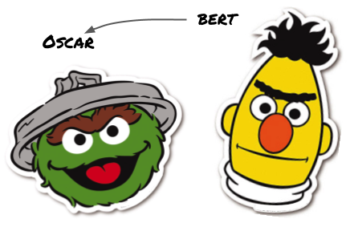
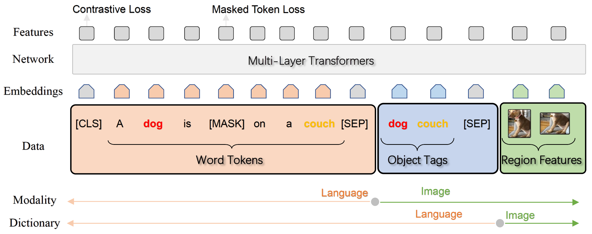

# Oscar: Object-Semantics Aligned Pre-training for Vision-and-Language Tasks     
# VinVL: Revisiting Visual Representations in Vision-Language Models  
## Updates
05/28/2020: Released finetuned models on downstream tasks, please check [MODEL_ZOO.md](MODEL_ZOO.md). <br/>
05/15/2020: Released pretrained models, datasets, and code for downstream tasks finetuning. <br/>
01/13/2021: our new work [VinVL](https://arxiv.org/abs/2101.00529) proposed OSCAR+, an improved version of OSCAR, and provided a better object-attribute detection model to extract features for V+L tasks. The VinVL work achieved SOTA performance on all seven V+L tasks here. Please stay tuned for the model and code release. <br/>
03/08/2021: Oscar+ pretraining code released, please check the last section in [VinVL_MODEL_ZOO.md](VinVL_MODEL_ZOO.md). All image features and model checkpoints in VinVL are also released. Please check [VinVL](https://github.com/pzzhang/VinVL) for details. <br/>
04/13/2021: Our [Scene Graph Benchmark Repo](https://github.com/microsoft/scene_graph_benchmark) has been released. Welcome to use the code there to extract image features with VinVL pretrained models. <br/>


## Introduction
This repository contains source code necessary to reproduce the results presented in the paper [Oscar: Object-Semantics Aligned Pre-training for Vision-Language Tasks](https://arxiv.org/abs/2004.06165).
We propose a new cross-modal pre-training method **Oscar** (Object-Semantics Aligned Pre-training). It leverages **object tags** detected in images as anchor points to significantly ease the learning of image-text alignments. We pre-train Oscar on the public corpus of 6.5 million text-image pairs, and fine-tune it on downstream tasks, creating new state-of-the-arts on six well-established vision-language understanding and generation tasks. For more on this project, see the [Microsoft Research Blog post](https://www.microsoft.com/en-us/research/blog/objects-are-the-secret-key-to-revealing-the-world-between-vision-and-language/).


 

## Performance
Task    | t2i | t2i | i2t | i2t | IC  | IC  |  IC  |  IC  | NoCaps | NoCaps |   VQA    |  NLVR2  |   GQA   |
--------|-----|-----|-----|-----|-----|-----|------|------|--------|--------|----------|---------|---------|
Metric	| R@1 | R@5 | R@1 | R@5 | B@4 |  M  |  C   |   S  |    C   |    S   | test-std | test-P  | test-std|
SoTA_S  |39.2 | 68.0|56.6 | 84.5|38.9 |29.2 |129.8 | 22.4 |   61.5 |  9.2   |  70.92   | 58.80   | 63.17   |
SoTA_B  |54.0 | 80.8|70.0 | 91.1|40.5 |29.7 |137.6 | 22.8 |   86.58| 12.38  |  73.67   | 79.30   |   -     |
SoTA_L  |57.5 | 82.8|73.5 | 92.2|41.7 |30.6 |140.0 | 24.5 |     -  |   -    |  74.93   | 81.47   |   -     |
-----   |---  |---  |---  |---  |---  |---  |---   |---   |---     |---     |---       |---      |---      |
Oscar_B |54.0 | 80.8|70.0 | 91.1|40.5 |29.7 |137.6 | 22.8 |   78.8 | 11.7   |  73.44   | 78.36   | 61.62   |
Oscar_L |57.5 | 82.8|73.5 | 92.2|41.7 |30.6 |140.0 | 24.5 |   80.9 | 11.3   |  73.82   | 80.05   |   -     |
-----   |---  |---  |---  |---  |---  |---  |---   |---   |---     |---     |---       |---      |---      |
VinVL_B |58.1 | 83.2|74.6 | 92.6|40.9 |30.9 |140.6 | 25.1 |   92.46| 13.07  |  76.12   | 83.08   | 64.65   |
VinVL_L |58.8 | 83.5|75.4 | 92.9|41.0 |31.1 |140.9 | 25.2 |     -  |   -    |  76.62   | 83.98   |   -     |
gain    | 1.3 |  0.7| 1.9 |  0.6| -0.7| 0.5 | 0.9  | 0.7  |    5.9 |  0.7   |   1.69   |  2.51   |  1.48   |

t2i: text-to-image retrieval; i2t: image-to-text retrieval; IC: image captioning on COCO. 


## Download
We released pre-trained models, datasets, VinVL image features, and Oscar+ pretraining corpus for downstream tasks. 
Please check [VinVL_DOWNLOAD.md](VinVL_DOWNLOAD.md) for details. 

To download checkpoints for the Vanilla OSCAR, please check [DOWNLOAD.md](DOWNLOAD.md) for details. 

## Installation
Check [INSTALL.md](INSTALL.md) for installation instructions.

## Model Zoo
Check [MODEL_ZOO.md](MODEL_ZOO.md) for scripts to run oscar downstream finetuning.

Check [VinVL_MODEL_ZOO.md](VinVL_MODEL_ZOO.md) for scripts to run oscar+ pretraining and downstream finetuning.

## Citations
Please consider citing this paper if you use the code:
```
@article{li2020oscar,
  title={Oscar: Object-Semantics Aligned Pre-training for Vision-Language Tasks},
  author={Li, Xiujun and Yin, Xi and Li, Chunyuan and Hu, Xiaowei and Zhang, Pengchuan and Zhang, Lei and Wang, Lijuan and Hu, Houdong and Dong, Li and Wei, Furu and Choi, Yejin and Gao, Jianfeng},
  journal={ECCV 2020},
  year={2020}
}

@article{zhang2021vinvl,
  title={VinVL: Making Visual Representations Matter in Vision-Language Models},
  author={Zhang, Pengchuan and Li, Xiujun and Hu, Xiaowei and Yang, Jianwei and Zhang, Lei and Wang, Lijuan and Choi, Yejin and Gao, Jianfeng},
  journal={CVPR 2021},
  year={2021}
}
```

## License
Oscar is released under the MIT license. See [LICENSE](LICENSE) for details. 

