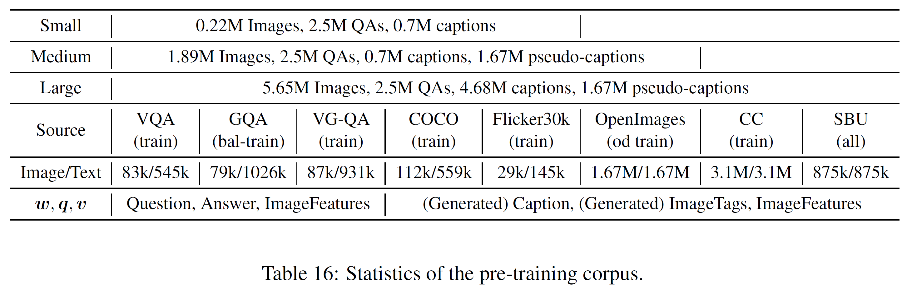

## Table of Contents
- <a href='#VQA'>VQA</a>
- <a href='#GQA'>GQA</a>
- <a href='#NLVR2'>NLVR2</a>
- <a href='#Image-Text-Retrieval'>Image/Text Retrieval</a>
- <a href='#Image-Captioning-on-COCO'>Image Captioning on COCO</a>
- <a href='#Oscarplus-pretraining'>Oscarplus pretraining</a>


## Performance
Task    | t2i | t2i | i2t | i2t | IC  | IC  |  IC  |  IC  | NoCaps | NoCaps |   VQA    |  NLVR2  |   GQA   |
--------|-----|-----|-----|-----|-----|-----|------|------|--------|--------|----------|---------|---------|
Metric	| R@1 | R@5 | R@1 | R@5 | B@4 |  M  |  C   |   S  |    C   |    S   | test-std | test-P  | test-std|
SoTA_S  |39.2 | 68.0|56.6 | 84.5|38.9 |29.2 |129.8 | 22.4 |   61.5 |  9.2   |  70.92   | 58.80   | 63.17   |
SoTA_B  |54.0 | 80.8|70.0 | 91.1|40.5 |29.7 |137.6 | 22.8 |   86.58| 12.38  |  73.67   | 79.30   | 61.62   |
SoTA_L  |57.5 | 82.8|73.5 | 92.2|41.7 |30.6 |140.0 | 24.5 |     -  |   -    |  74.93   | 81.47   |   -     |
-----   |---  |---  |---  |---  |---  |---  |---   |---   |---     |---     |---       |---      |---      |
VinVL_B |58.1 | 83.2|74.6 | 92.6|40.9 |30.9 |140.4 | 25.1 |   92.46 (with [VIVO](https://arxiv.org/abs/2009.13682))| 13.07 (with [VIVO](https://arxiv.org/abs/2009.13682))  |  76.12   | 83.08   | 64.65   |
VinVL_L |58.8 | 83.5|75.4 | 92.9|41.0 |31.1 |140.9 | 25.2 |     -  |   -    |  76.62   | 83.98   |   -     |
gain    | 1.3 |  0.7| 1.9 |  0.6| -0.7| 0.5 | 0.9  | 0.7  |    5.9 |  0.7   |   1.69   |  2.51   |  1.48   |

t2i: text-to-image retrieval; i2t: image-to-text retrieval; IC: image captioning on COCO. 

For reference, we also release the training logs and output.


## VQA
Script to finetune for Oscar base model.
Base model is trained on train split and evaluated on the val split. Good for later comparison.
<!---
Training logs: [eval_logs.json](https://biglmdiag.blob.core.windows.net/oscar/exp/vqa/base/base_9m_ep107_1192k_eu1/application_1575931286052_40649/results/eval_logs.json), [output.txt](https://biglmdiag.blob.core.windows.net/oscar/exp/vqa/base/base_9m_ep107_1192k_eu1/application_1575931286052_40649/results/stdout.txt).<br />
--->
Final server results: [results.txt](https://biglmdiag.blob.core.windows.net/vinvl/model_ckpts/vqa/base/test/results.txt).<br />
Model checkpoint: [.zip](https://biglmdiag.blob.core.windows.net/vinvl/model_ckpts/vqa/base/best.zip).
```bash
python oscar/run_vqa.py -j 4 --img_feature_dim 2054 --max_img_seq_length
    50 --data_label_type mask --img_feature_type faster_r-cnn --data_dir vinvl/datasets/vqa
    --model_type bert --model_name_or_path vinvl/model_ckpts/vqa/base/checkpoint-2000000
    --task_name vqa_text --do_train --do_lower_case --max_seq_length 128 --per_gpu_eval_batch_size
    256 --per_gpu_train_batch_size 32 --learning_rate 5e-05 --num_train_epochs 25
    --output_dir results --label_file datasets/vqa/cache/trainval_ans2label.pkl
    --save_epoch 1 --seed 88 --evaluate_during_training --logging_steps 4000 --drop_out
    0.3 --weight_decay 0.05 --warmup_steps 0 --loss_type bce --img_feat_format pt 
    --classifier linear --cls_hidden_scale 3 --txt_data_dir vinvl/datasets/vqa
```

Script to finetune for Oscar large model.
Large model is trained on train+val split and evaluated on the val split, for reproduce the paper's best result.

<!---
Training logs: [eval_logs.json](https://biglmdiag.blob.core.windows.net/oscar/exp/vqa/large/ab128_img_large_rr1_ep20_590k_tv_done_good/exp_ab128_img_large_rr1_ep20_590k_tv_0.00003_128_50_dp_0.3_wd_0.05_bce_3linear_s88_abcd/results/eval_logs.json), [output.txt](https://biglmdiag.blob.core.windows.net/oscar/exp/vqa/large/ab128_img_large_rr1_ep20_590k_tv_done_good/exp_ab128_img_large_rr1_ep20_590k_tv_0.00003_128_50_dp_0.3_wd_0.05_bce_3linear_s88_abcd/stdout.txt).<br />
--->
Final server results: [results.txt](https://biglmdiag.blob.core.windows.net/vinvl/model_ckpts/vqa/large/test/results.txt).<br />
Model checkpoint: [.zip](https://biglmdiag.blob.core.windows.net/vinvl/model_ckpts/vqa/large/best.zip).
```bash
python oscar/run_vqa.py -j 4 --img_feature_dim 2054 --max_img_seq_length
    50 --data_label_type mask --img_feature_type faster_r-cnn --data_dir vinvl/datasets/vqa
    --model_type bert --model_name_or_path vinvl/model_ckpts/vqa/large/checkpoint-2000000
    --task_name vqa_text --do_train_val --do_lower_case --max_seq_length 128 --per_gpu_eval_batch_size
    256 --per_gpu_train_batch_size 24 --learning_rate 3e-05 --num_train_epochs 25
    --label_file datasets/vqa/cache/trainval_ans2label.pkl --save_epoch 30
    --seed 88 --evaluate_during_training --logging_steps 4000 --drop_out 0.3 --weight_decay
    0.05 --warmup_steps 0 --loss_type bce --save_after_epoch 15 --output_dir results --img_feat_format pt --classifier linear --cls_hidden_scale 3 --txt_data_dir vinvl/datasets/vqa
```


## GQA
Script to finetune for Oscar base model.

<!---
Training logs: [eval_logs.json](https://biglmdiag.blob.core.windows.net/oscar/exp/gqa/base/ab175_base_ep107_1192k_0.4true_taeb_done_25eps_good/exp_ab175_base_ep107_1192k_0.4true_taeb_b_48_0.00005_165_45_dp_0.3_abce/results/eval_logs.json), [output.txt](https://biglmdiag.blob.core.windows.net/oscar/exp/gqa/base/ab175_base_ep107_1192k_0.4true_taeb_done_25eps_good/exp_ab175_base_ep107_1192k_0.4true_taeb_b_48_0.00005_165_45_dp_0.3_abce/stdout.txt).<br />
--->
Final server results: [results.txt](https://biglmdiag.blob.core.windows.net/vinvl/model_ckpts/gqa/base/results.txt).<br />
Model checkpoint: [.zip](https://biglmdiag.blob.core.windows.net/vinvl/model_ckpts/gqa/base/best.zip).
```bash
python oscar/run_gqa.py -j 4 --img_feature_dim 2054 --max_img_seq_length
    45 --data_dir vinvl/datasets/gqa --model_type bert --model_name_or_path vinvl/model_ckpts/vqa/base/checkpoint-2000000
    --task_name gqa --do_lower_case --max_seq_length 165 --per_gpu_eval_batch_size
    256 --per_gpu_train_batch_size 48 --learning_rate 5e-05 --num_train_epochs 5 --output_dir
    results --label_file vinvl/datasets/gqa/trainval_testdev_all_ans2label.pkl
    --img_feature_type faster_r-cnn --data_label_type all --train_data_type all --eval_data_type
    bal --label2ans_file vinvl/datasets/gqa/trainval_testdev_all_label2ans.pkl
    --loss_type xe --save_epoch 2 --seed 88 --evaluate_during_training --logging_steps
    4000 --drop_out 0.3 --do_train --weight_decay 0.05 --warmup_steps 0
```

## NLVR2
Script to finetune for Oscar base model.

<!---
Training logs: [eval_logs.json](https://biglmdiag.blob.core.windows.net/oscar/exp/nlvr2/base/exp_rvln_base_ep107_1192k_wm1w_b72_0.00003_55_40_dp0.3_3mlp_wm10000_abcf_best/results/eval_logs.json), [output.txt](https://biglmdiag.blob.core.windows.net/oscar/exp/nlvr2/base/exp_rvln_base_ep107_1192k_wm1w_b72_0.00003_55_40_dp0.3_3mlp_wm10000_abcf_best/stdout.txt).<br />
--->
Final server results: [results.txt](https://biglmdiag.blob.core.windows.net/vinvl/model_ckpts/nlvr2/base/rvln_base_oscar_v2_71.5_86236_test_done_best/exp_rvln_base_oscar_v2_71.5_86236_test_b24_0.00003_55_41_dp_0.3_mlp_abch/stdout.txt).<br />
Model checkpoint: [.zip](https://biglmdiag.blob.core.windows.net/vinvl/model_ckpts/nlvr2/base/best.zip).
```bash
python oscar/run_nlvr.py -j 4 --img_feature_dim 2054 --max_img_seq_length
    40 --data_dir vinvl/datasets/nlvr2 --model_type bert --model_name_or_path vinvl/model_ckpts/vqa/base/checkpoint-2000000
    --task_name nlvr --do_lower_case --max_seq_length 55 --per_gpu_eval_batch_size
    64 --per_gpu_train_batch_size 72 --learning_rate 3e-05 --num_train_epochs 20 --output_dir
    results --img_feature_type faster_r-cnn --data_label_type all --train_data_type
    all --eval_data_type all --loss_type xe --save_epoch -1 --seed 88 --evaluate_during_training
    --logging_steps -1 --drop_out 0.3 --do_train --weight_decay 0.05 --warmup_steps
    10000 --classifier mlp --cls_hidden_scale 3 --num_choice 2 --use_pair
```

Script to finetune for Oscar large model.

<!---
Training logs: [eval_logs.json](https://biglmdiag.blob.core.windows.net/oscar/exp/nlvr2/large/large_1583307153868_14140/exp_rvln_large_ep55_1618k_b24_0.00002_seq55_img40_dp0.3_2mlp_wm5000_abcj/results/eval_logs.json), [output.txt](https://biglmdiag.blob.core.windows.net/oscar/exp/nlvr2/large/large_1583307153868_14140/exp_rvln_large_ep55_1618k_b24_0.00002_seq55_img40_dp0.3_2mlp_wm5000_abcj/stdout.txt).<br />
--->
Final server results: [results.txt](https://biglmdiag.blob.core.windows.net/vinvl/model_ckpts/nlvr2/large/rvln_oscar_v2_large_99617_test_done_best/exp_rvln_oscar_v2_large_99617_test_b24_0.00003_55_50_dp_0.3_mlp_abce/stdout.txt).<br />
Model checkpoint: [.zip](https://biglmdiag.blob.core.windows.net/vinvl/model_ckpts/nlvr2/large/best.zip).
```bash
python oscar/run_nlvr.py -j 4 --img_feature_dim 2054 --max_img_seq_length
    40 --data_dir vinvl/datasets/nlvr2 --model_type bert --model_name_or_path vinvl/model_ckpts/vqa/large/checkpoint-2000000
    --task_name nlvr --do_lower_case --max_seq_length 55 --per_gpu_eval_batch_size
    64 --per_gpu_train_batch_size 24 --learning_rate 3e-05 --num_train_epochs 20 --output_dir
    results --img_feature_type faster_r-cnn --data_label_type all --train_data_type
    all --eval_data_type all --loss_type xe --save_epoch -1 --seed 88 --evaluate_during_training
    --logging_steps -1 --drop_out 0.3 --do_train --weight_decay 0.05 --warmup_steps
    5000 --classifier mlp --cls_hidden_scale 2 --num_choice 2 --use_pair
```

<!---
Training logs: [eval_logs.json](https://biglmdiag.blob.core.windows.net/oscar/exp/nlvr2/large/large_1583307153868_14140/exp_rvln_large_ep55_1618k_b24_0.00002_seq55_img40_dp0.3_2mlp_wm5000_abcj/results/eval_logs.json), [output.txt](https://biglmdiag.blob.core.windows.net/oscar/exp/nlvr2/large/large_1583307153868_14140/exp_rvln_large_ep55_1618k_b24_0.00002_seq55_img40_dp0.3_2mlp_wm5000_abcj/stdout.txt).<br />
Final server results: [results.txt](https://biglmdiag.blob.core.windows.net/oscar/exp/nlvr2/large/large_1583307153868_14140/exp_nlvr_large_1583307153868_14140_testall_b24_0.00003_55_43_dp_0.3_mlp_abck/stdout.txt).
```bash
python oscar/run_nlvr.py -j 4 --img_feature_dim 2054 --max_img_seq_length
    40 --data_dir datasets/nlvr2/ft_corpus --model_type bert --model_name_or_path pretrained_models/base-vg-labels/ep_55_1617000
    --task_name nlvr --do_lower_case --max_seq_length 55 --per_gpu_eval_batch_size
    64 --per_gpu_train_batch_size 24 --learning_rate 3e-05 --num_train_epochs 20 --output_dir
    results --img_feature_type faster_r-cnn --data_label_type all --train_data_type
    all --eval_data_type all --loss_type xe --save_epoch -1 --seed 88 --evaluate_during_training
    --logging_steps -1 --drop_out 0.3 --do_train --weight_decay 0.05 --warmup_steps
    5000 --classifier mlp --cls_hidden_scale 2 --num_choice 2 --use_pair
```
--->

## Image Text Retrieval
Script to finetune for Oscarplus base model (8 V100 with 16G mem):

Training logs: [train_logs](https://biglmdiag.blob.core.windows.net/vinvl/model_ckpts/coco_ir/base/train_logs/), 

Training logs: [test_logs](https://biglmdiag.blob.core.windows.net/vinvl/model_ckpts/coco_ir/base/test_logs/), 

Command [command](https://biglmdiag.blob.core.windows.net/vinvl/model_ckpts/coco_ir/base/philly.yaml).

Model checkpoint: [ckeckpoint](https://biglmdiag.blob.core.windows.net/vinvl/model_ckpts/coco_ir/base/checkpoint-0132780/).

```bash
python oscar/run_retrieval.py \
    --model_name_or_path vinvl/coco_ir/base/checkpoint-1340000 \
    --do_train \
    --do_lower_case \
    --evaluate_during_training \
    --num_captions_per_img_val 20 \
    --eval_caption_index_file minival_caption_indexs_top20.pt \
    --per_gpu_train_batch_size 16 \
    --learning_rate 0.00002 \
    --num_train_epochs 30 \
    --weight_decay 0.05 \
    --save_steps 5000 \
    --add_od_labels \
    --od_label_type vg \
    --max_seq_length 70 \
    --max_img_seq_length 70 \
    --output_dir output/
```

Script to finetune for Oscarplus large model (8 V100 with 32G mem):

Training logs: [train_logs](https://biglmdiag.blob.core.windows.net/vinvl/model_ckpts/coco_ir/large/train_logs/), 

Training logs: [test_logs](https://biglmdiag.blob.core.windows.net/vinvl/model_ckpts/coco_ir/large/test_logs/), 

Command [command](https://biglmdiag.blob.core.windows.net/vinvl/model_ckpts/coco_ir/large/philly.yaml).

Model checkpoint: [ckeckpoint](https://biglmdiag.blob.core.windows.net/vinvl/model_ckpts/coco_ir/large/checkpoint-0132780/).

```bash
python oscar/run_retrieval.py \
    --model_name_or_path vinvl/coco_ir/base/checkpoint-0660000 \
    --do_train \
    --do_lower_case \
    --evaluate_during_training \
    --num_captions_per_img_val 20 \
    --eval_caption_index_file minival_caption_indexs_top20.pt \
    --per_gpu_train_batch_size 16 \
    --learning_rate 7.5e-06 \
    --num_train_epochs 30 \
    --save_steps 5000 \
    --add_od_labels \
    --od_label_type vg \
    --max_seq_length 70 \
    --max_img_seq_length 70 \
    --output_dir output \
    --img_feat_file vinvl/image_features/coco_X152C4_frcnnbig2_exp168model_0060000model.roi_heads.nm_filter_2_model.roi_heads.score_thresh_0.2/model_0060000/features.tsv 
```

Script to inference on COCO 1K test set:
```bash
python oscar/run_retrieval.py \
    --do_test \
    --do_eval \
    --test_split test \
    --num_captions_per_img_val 5 \
    --eval_img_keys_file test_img_keys_1k.tsv \
    --cross_image_eval \
    --per_gpu_eval_batch_size 64 \
    --img_feat_file vinvl/image_features/coco_X152C4_frcnnbig2_exp168model_0060000model.roi_heads.nm_filter_2_model.roi_heads.score_thresh_0.2/model_0060000/features.tsv \
    --eval_model_dir your_model_for_evaluation # could be base/large models.
```

Script to inference on COCO 5K test set:
```bash
python oscar/run_retrieval.py \
    --do_test \
    --do_eval \
    --test_split test \
    --num_captions_per_img_val 5 \
    --eval_img_keys_file test_img_keys.tsv \
    --cross_image_eval \
    --per_gpu_eval_batch_size 64 \
    --img_feat_file vinvl/image_features/coco_X152C4_frcnnbig2_exp168model_0060000model.roi_heads.nm_filter_2_model.roi_heads.score_thresh_0.2/model_0060000/features.tsv \
    --eval_model_dir your_model_for_evaluation # could be base/large models.
```


## Image Captioning on COCO
Script to finetune for base model:

Pretrained model checkpoint: [pretrained_base.zip](https://biglmdiag.blob.core.windows.net/vinvl/model_ckpts/image_captioning/pretrained_base.zip).
Finetuned model checkpoint (w/ cross entropy): [coco_captioning_base_xe.zip](https://biglmdiag.blob.core.windows.net/vinvl/model_ckpts/image_captioning/coco_captioning_base_xe.zip).
Finetuned model checkpoint (w/ CIDEr optimization): [coco_captioning_base_scst.zip](https://biglmdiag.blob.core.windows.net/vinvl/model_ckpts/image_captioning/coco_captioning_base_scst.zip).

1) First train with cross-entropy loss (8 V100 with 16G mem):
```bash
python oscar/run_captioning.py \
    --model_name_or_path pretrained_models/image_captioning/pretrained_base \
    --do_train \
    --do_lower_case \
    --add_od_labels \
    --learning_rate 3e-5 \
    --per_gpu_train_batch_size 64 \
    --num_train_epochs 60 \
    --tie_weights \
    --freeze_embedding \
    --label_smoothing 0.1 \
    --drop_worst_ratio 0.2 \
    --drop_worst_after 20000 \
    --output_dir output/
```
2) Finetune with CIDEr optimization (8 V100 with 32G mem):
```bash
python oscar/run_captioning.py \
    --model_name_or_path your_checkpoint_from_cross_entropy \
    --do_train \
    --do_lower_case \
    --add_od_labels \
    --learning_rate 3e-6 \
    --per_gpu_train_batch_size 16 \
    --num_train_epochs 75 \
    --tie_weights \
    --freeze_embedding \
    --scst \
    --output_dir output/
```

Script to finetune for large model:

Pretrained model checkpoint: [pretrained_large.zip](https://biglmdiag.blob.core.windows.net/vinvl/model_ckpts/image_captioning/pretrained_large.zip).
Finetuned model checkpoint (w/ cross entropy): [coco_captioning_large_xe.zip](https://biglmdiag.blob.core.windows.net/vinvl/model_ckpts/image_captioning/coco_captioning_large_xe.zip).
Finetuned model checkpoint (w/ CIDEr optimization): [coco_captioning_large_scst.zip](https://biglmdiag.blob.core.windows.net/vinvl/model_ckpts/image_captioning/coco_captioning_large_scst.zip).

1) First train with cross-entropy loss (8 V100 with 32G mem):
```bash
python oscar/run_captioning.py \
    --model_name_or_path pretrained_models/image_captioning/pretrained_large \
    --do_train \
    --do_lower_case \
    --add_od_labels \
    --learning_rate 1e-5 \
    --per_gpu_train_batch_size 64 \
    --num_train_epochs 60 \
    --tie_weights \
    --freeze_embedding \
    --label_smoothing 0.1 \
    --drop_worst_ratio 0.2 \
    --drop_worst_after 20000 \
    --output_dir output/
```
2) Finetune with CIDEr optimization (8 V100 with 32G mem):
```bash
python oscar/run_captioning.py \
    --model_name_or_path your_checkpoint_from_cross_entropy \
    --do_train \
    --do_lower_case \
    --add_od_labels \
    --learning_rate 8e-7 \
    --per_gpu_train_batch_size 6 \
    --num_train_epochs 25 \
    --tie_weights \
    --freeze_embedding \
    --scst \
    --output_dir output/
```

Script to inference on COCO test set:
```bash
python oscar/run_captioning.py \
    --do_test \
    --do_eval \
    --test_yaml test.yaml \
    --per_gpu_eval_batch_size 64 \
    --num_beams 5 \ 
    --max_gen_length 20 \
    --eval_model_dir your_model_for_evaluation # could be base or large models
```

## Image Captioning on NoCaps
Note that [NoCaps] (https://nocaps.org/) does not allow to use extra
image-caption pairs for training except COCO. So the model is directly initialized
from bert-base, and trained on COCO data.

Script to train base model:

Finetuned model checkpoint (w/ cross entropy): [nocaps_base_xe.zip](https://biglmdiag.blob.core.windows.net/vinvl/model_ckpts/image_captioning/nocaps_base_xe.zip).
Finetuned model checkpoint (w/ CIDEr optimization): [nocaps_base_scst.zip](https://biglmdiag.blob.core.windows.net/vinvl/model_ckpts/image_captioning/nocaps_base_scst.zip).

1) First train with cross-entropy loss (4 V100 with 16G mem):
```bash
python oscar/run_captioning.py \
    --model_name_or_path bert-base-uncased \
    --do_train \
    --do_lower_case \
    --add_od_labels \
    --learning_rate 0.0001 \
    --per_gpu_train_batch_size 64 \
    --num_train_epochs 30 \
    --tie_weights \
    --freeze_embedding \
    --output_dir output/
```
2) Train with CIDEr optimization (8 V100 with 32G mem):
```bash
python oscar/run_captioning.py \
    --model_name_or_path your_checkpoint_from_cross_entropy \
    --do_train \
    --do_lower_case \
    --add_od_labels \
    --scheduler constant \
    --learning_rate 5e-6 \
    --per_gpu_train_batch_size 14 \
    --num_train_epochs 50 \
    --tie_weights \
    --freeze_embedding \
    --scst \
    --output_dir output/
```

Script to inference on NoCaps val set with Constrained Beam Search:
```bash
python oscar/run_captioning.py \
    --do_test \
    --do_eval \
    --data_dir datasets/nocaps \
    --test_yaml val.yaml \
    --per_gpu_eval_batch_size 2 \
    --num_beams 5 \
    --use_cbs \
    --max_gen_length 20 \
    --eval_model_dir your_model_for_evaluation
```

<!---
## VCR
Script to finetune for Oscar base model.

```bash
python oscar/run_vcr.py -j 4 --img_feature_dim 2054 --max_img_seq_length 50 --data_label_type mask --img_feature_type faster_r-cnn --data_dir datasets/vcr/X152C4_71.5/gt_box_feats --txt_data_dir datasets/vcr/new_corpus_v3 --model_type bert --model_name_or_path pretrained_models/base-vg-labels/ep_107_1192087 --task_name vcr_qar --do_lower_case --max_seq_length 202 --per_gpu_eval_batch_size 64 --per_gpu_train_batch_size 12 --learning_rate 3e-5 --num_train_epochs 2 --output_dir results/vcr --save_epoch 8 --seed 88 --evaluate_during_training --logging_steps 10 --drop_out 0.3 --weight_decay 0.05 --warmup_steps 0 --loss_type bce --save_steps 2000 --img_feat_dir datasets/vcr/X152C4_71.5/gt_box_feats --img_feat_format pt --num_choice 2 --classifier linear --cls_hidden_scale 2 --do_train --save_task_best
```
--->

## Oscarplus pretraining
Table 16 below shows the statistics of image and text of the pre-training corpora. 
In our ablation study, we have corpora of three different sizes: [Small](https://biglmdiag.blob.core.windows.net/vinvl/pretrain_corpus/coco_flickr30k_gqa_x152c4big2exp168.yaml), [Medium](https://biglmdiag.blob.core.windows.net/vinvl/pretrain_corpus/coco_flickr30k_gqa_oi_x152c4big2exp168.yaml), [Large](https://biglmdiag.blob.core.windows.net/vinvl/pretrain_corpus/coco_flickr30k_googlecc_gqa_sbu_oi_x152c4big2exp168.yaml). 
Notice that we make use of image tagging datasets OpenImages, by generating captions using OSCAR's image captioning model to form triplets of ``(generated caption, image tags, image features)'' for the OSCAR+ pre-training. 
 

Script to perform oscar+ pretraining with the [large corpus](https://biglmdiag.blob.core.windows.net/vinvl/pretrain_corpus/coco_flickr30k_googlecc_gqa_sbu_oi_x152c4big2exp168.yaml). 
```bash
python -m torch.distributed.launch --nproc_per_node=8 oscar/run_oscarplus_pretrain.py \
    --use_b 1 \
    --max_grad_norm 10.0 --gradient_accumulation_steps 1 \
    --use_img_layernorm 1 \
    --output_dir <your output folder> \
    --bert_model bert --model_name_or_path bert-base-uncased \
    --do_lower_case --learning_rate 5e-05 
    --warmup_steps 0 --do_train --max_seq_length 35 --on_memory \
    --max_img_seq_length 50 --img_feature_dim 2054 \
    --drop_out 0.1 --train_batch_size 8 \
    --ckpt_period 10000 --max_iters 2000000 --log_period 100 \
    --data_dir <The input data dir that contain the .yaml files> --dataset_file coco_flickr30k_googlecc_gqa_sbu_oi_x152c4big2exp168.yaml
    --textb_sample_mode 1 --texta_false_prob 0.25 
```


One can perform the vanilla OSCAR pretraining by setting 
```bash
    --textb_sample_mode 0 --texta_false_prob 0.0
```

One can also split the large pretraining corpus into two parts, i.e., coco_flickr30k_gqa + googlecc_sbu_oi, and use different textb_sample_modes for them. 
To set textb_sample_mode=2 for coco_flickr30k_gqa has the potential to emphasize the QA-pairs in the small corpus. 
```bash
    --data_dir <The input data dir that contain the .yaml files> --dataset_file coco_flickr30k_gqa_x152c4big2exp168.yaml
    --textb_sample_mode 2 --texta_false_prob 0.25 \
    --extra_dataset_file googlecc_sbu_oi_x152c4big2exp168.yaml \
    --extra_textb_sample_mode 1 --extra_loss_weight 0.5
```